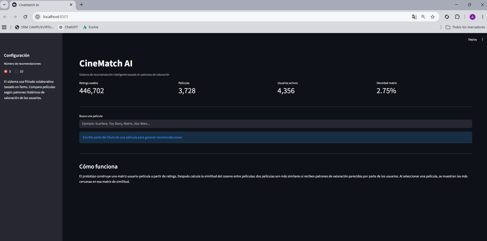
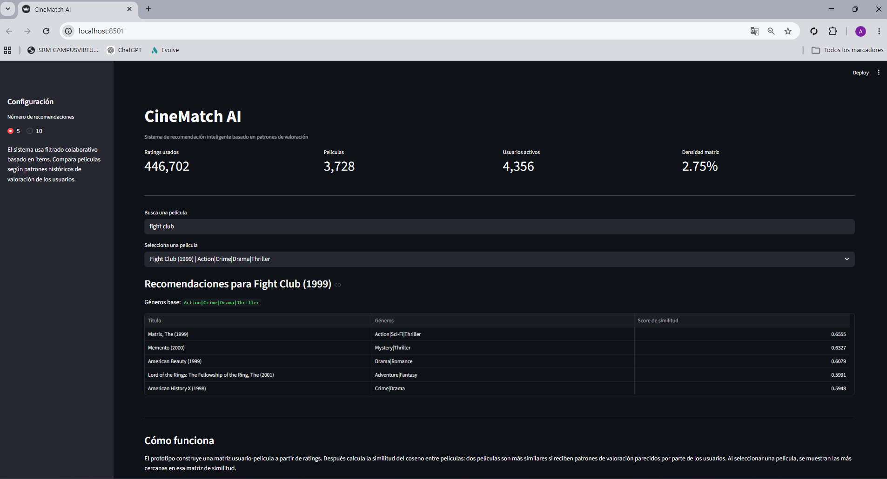
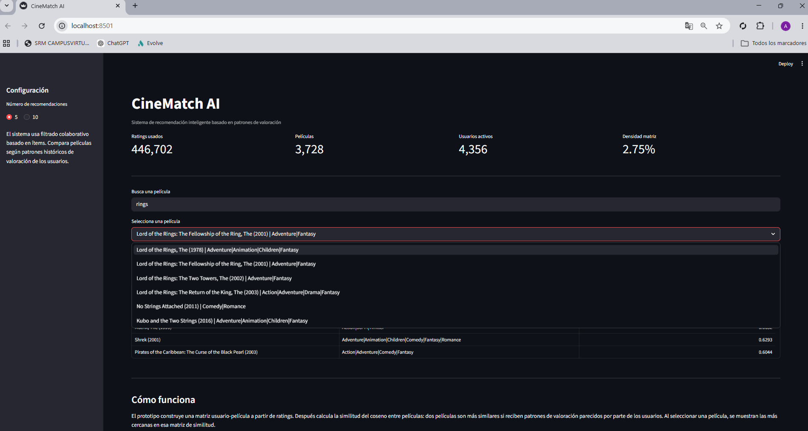
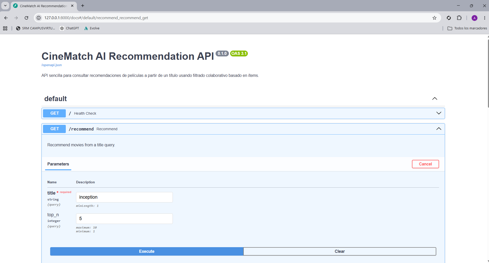
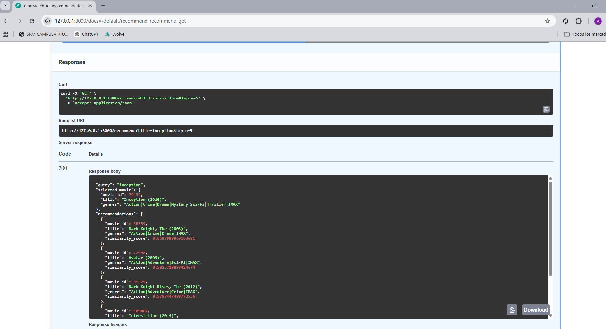
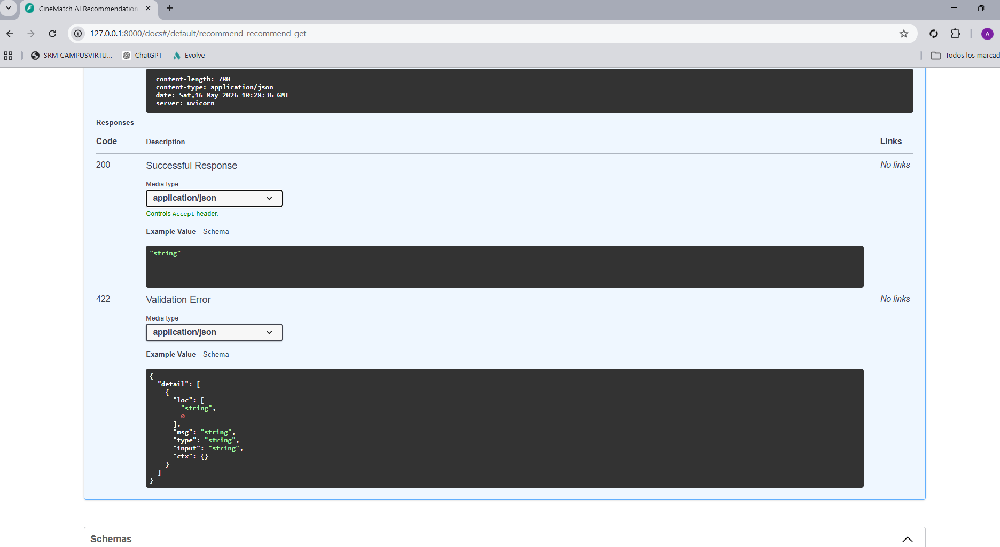

# CineMatch AI

Sistema de recomendación inteligente basado en filtrado colaborativo para personalización de contenidos.

CineMatch AI es un proyecto de portfolio profesional de Data Science & Applied AI. El objetivo es presentar un prototipo funcional, limpio y reproducible que demuestra análisis de datos, modelado aplicado y comunicación técnica.

No se plantea como una solución enterprise ni como un sistema productivo completo. Es un prototipo defendible para mostrar cómo se construye, evalúa y presenta un sistema de recomendación a partir de datos reales.

## Problema

Las plataformas digitales con catálogos amplios necesitan ayudar al usuario a descubrir contenido relevante. En este caso, el problema se formula como:

Dada una película de referencia, recomendar películas similares usando patrones históricos de valoración de usuarios.

## Contexto de negocio

Un recomendador de este tipo puede ayudar a mejorar la experiencia de usuario en entornos con catálogos amplios. En este proyecto se trabaja el caso de películas porque permite explicar la lógica de recomendación de forma visual, intuitiva y cercana.

## Aplicaciones de negocio

La lógica de recomendación aplicada en CineMatch AI puede adaptarse a diferentes dominios:

- retail: sugerencia de artículos relacionados según comportamiento histórico
- streaming: recomendación de películas, series, música o podcasts
- e-commerce: personalización de escaparates y productos similares
- personalización de contenidos: priorización de noticias, cursos o publicaciones
- recomendación de productos: identificación de alternativas relevantes para cada usuario

## Dataset

MovieLens se usa como dataset de referencia para construir y validar el prototipo. El proyecto trabaja con:

- 500.000 ratings
- 45.447 películas originales
- 5.178 usuarios originales
- 15.534 películas con al menos un rating en el subconjunto usado

Tras el filtrado aplicado en el notebook:

- 446.702 ratings finales
- 3.728 películas en el sistema
- 4.356 usuarios activos
- densidad de matriz usuario-película: 2,75%

Los archivos esperados son:

- `data/ratings.csv`
- `data/movies.csv`

Por tamaño y buenas prácticas, los CSV no se incluyen en GitHub.

## Metodología

El sistema implementa filtrado colaborativo basado en ítems:

1. Carga de `ratings.csv` y `movies.csv`.
2. Análisis exploratorio del volumen, distribución de ratings y géneros.
3. Filtrado de películas populares con al menos 20 ratings.
4. Filtrado de usuarios activos con al menos 10 ratings.
5. Construcción de una matriz usuario-película.
6. Transposición de la matriz para comparar películas entre sí.
7. Cálculo de similitud del coseno entre películas.
8. Búsqueda de películas por título.
9. Generación de recomendaciones ordenadas por score de similitud.

## Tecnologías utilizadas

- Python
- Pandas
- NumPy
- Scikit-learn
- SciPy
- Matplotlib / Seaborn
- Streamlit
- FastAPI
- Jupyter Notebook

## Estructura del repositorio

```text
Proyecto-Master-DataScience-Evolve-AlbertoMartinez/
├── README.md
├── requirements.txt
├── .gitignore
├── notebooks/
│   └── 01_movie_recommender_analysis.ipynb
├── src/
│   ├── data_processing.py
│   └── recommender.py
├── app/
│   └── streamlit_app.py
├── api/
│   └── main.py
├── assets/
│   └── README.md
└── data/
    └── README.md
```

## Cómo ejecutarlo

1. Clonar el repositorio o abrir la carpeta del proyecto.

2. Crear y activar un entorno virtual:

```bash
python -m venv .venv
source .venv/bin/activate
```

En Windows:

```bash
.venv\Scripts\activate
```

3.Instalar dependencias:

```bash
pip install -r requirements.txt
```

4.Colocar los datasets en `data/`:

```text
data/ratings.csv
data/movies.csv
```

5.Ejecutar la demo principal con Streamlit:

```bash
streamlit run app/streamlit_app.py
```

## Demo Streamlit

La demo permite:

- buscar una película por título
- seleccionar una coincidencia del catálogo filtrado
- elegir top 5 o top 10 recomendaciones
- visualizar título, géneros y score de similitud
- entender brevemente la lógica del sistema

Streamlit es la interfaz principal del proyecto porque facilita una presentación visual y directa.

## Capturas

### Demo principal de Streamlit



### Ejemplo de recomendaciones



### Selección de películas



## API opcional

La API se incluye como demostración complementaria de despliegue y exposición del modelo, sin ser el foco principal del proyecto.

Ejecutar:

```bash
uvicorn api.main:app --reload
```

Para abrir la interfaz en local:

`http://127.0.0.1:8000/docs`

### Documentación interactiva FastAPI



### Ejemplo de respuesta JSON




## Resultados principales

El análisis reproducible obtiene:

- matriz usuario-película de 4.356 usuarios por 3.728 películas
- 446.702 ratings utilizados tras filtrado
- evaluación exploratoria sobre 100 películas populares
- 10 recomendaciones generadas por película evaluada
- similitud media top-N: 0,5662
- consistencia media de géneros: 81,5%
- 94 de 100 películas con consistencia de géneros superior al 50%
- cobertura sobre el catálogo completo: 8,2%

Ejemplo para `Scarface (1983)`:

| Ranking | Recomendación | Géneros | Score |
| ---: | --- | --- | ---: |
| 1 | Reservoir Dogs (1992) | Crime, Mystery, Thriller | 0,4485 |
| 2 | Snatch (2000) | Comedy, Crime, Thriller | 0,4313 |
| 3 | Goodfellas (1990) | Crime, Drama | 0,4310 |
| 4 | Full Metal Jacket (1987) | Drama, War | 0,4258 |
| 5 | Sin City (2005) | Action, Crime, Film-Noir, Mystery, Thriller | 0,4246 |

## Limitaciones

- Problema de cold start para películas o usuarios nuevos.
- La matriz usuario-película sigue siendo dispersa.
- El filtrado por popularidad reduce cobertura del catálogo.
- El sistema recomienda por similitud histórica, no por contenido semántico profundo.
- No incorpora feedback en tiempo real ni actualización incremental.
- La evaluación es exploratoria y no usa separación train/test; por tanto, no debe interpretarse como una métrica predictiva supervisada.
- No evalúa ranking con métricas como Precision@K, Recall@K o NDCG.

## Próximos pasos

- Añadir filtrado híbrido combinando ratings y géneros.
- Incorporar reducción de dimensionalidad con SVD o NMF.
- Mejorar evaluación offline con métricas de ranking.
- Guardar la matriz de similitud precomputada para acelerar la demo.

## Nota final

Proyecto académico desarrollado durante el Máster en Data Science & Desarrollo de IA de Evolve.
